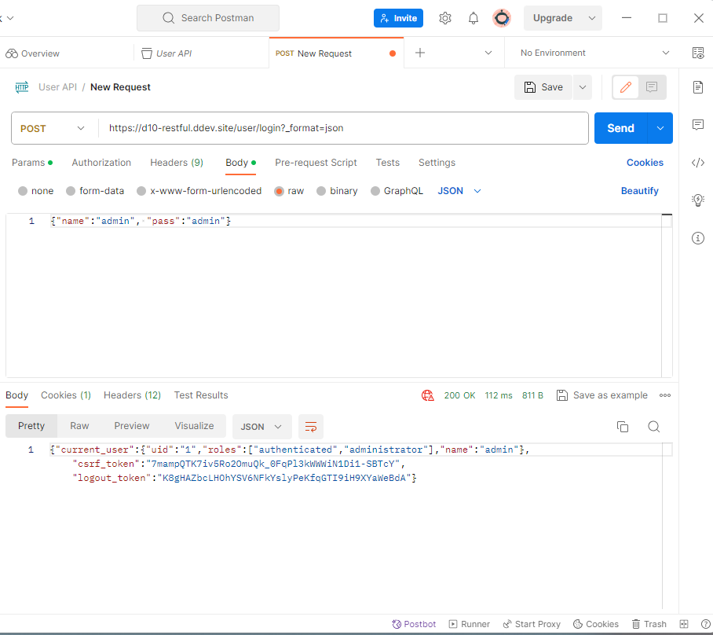
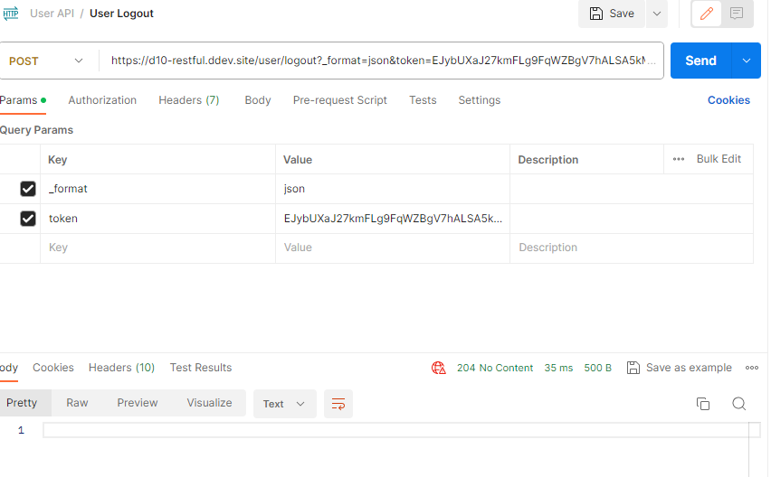

## JSON Collection

Запросы -> files/Rest Api.postman_collection.json

## Включаем модули
> * Serialization
> * REST UI
> * RESTful Web Services

#### Пути
> * https://d10-restful.ddev.site/admin/config/services
> * https://d10-restful.ddev.site/admin/config/services/rest

### User Login

## Включаем модули
> * HTTP Basic Authentication

### User Logout

### User Info
Настройка https://d10-restful.ddev.site/admin/config/services/rest

